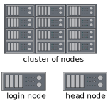



## HPC architecture overview

### General 

### Cluster 

A cluster is a group of computers networked together.

### Login Node

The login node is where you connect to the cluster and submit jobs.

### Administrative Nodes

The administrative nodes are what manage the cluster scheduling and other admin tasks, users do not login to these. 

### Compute Nodes

The compute nodes are where the computational tasks are carried out. Sumhpc includes 100 Supermicro X11DPT-B Series servers with 70 Intel Xeon Gold 6150 computable cores at 2.7GHz and 768 GB RAM.  Sumhpc include 2 high-mem nodes with 142 Intel Xeon Gold 6150 cores at 2.7GHz and 3 TB RAM available per none for workloads that exceed 768 GB RAM.

### Cluster Accessible Storage

Working storage (Tier 0, /fastscratch) on Sumhpc is provided by a Data Direct Networks Gridscalar GS7k GPFS storage appliance with 522 TB usable storage capacity.

Primary storage (Tier 1) on Sumhpc is provided 27 Dell EMC Isilon scale-out NAS nodes combined for a total of 2.7 PB raw storage capacity. Your home drive (50 Gb capacity) is mounted tier 1 as is lab project folders.

Other storage (Tier 2) this 2 PB of capacity is non-HPC storage and is not accessible to HPC resources 2 PB of new non-computable capacity. Access to tier 2 is through the Globus application (link globus).

### Archival Storage:

Archival storage (Tier 3) is provided at both Bar Harbor, ME and Farmington, CT by 2 Quantum Artico StorNext appliances with 72 TB front-end disk capacity backed by a 4 PB tape library at each site.  Data storage at this tier is replicated across both geographic sites.

### Network Infrastructure:

Our network platform supports scientific and enterprise business systems, using 40Gb core switches in our server farm that delivers at least 1Gb to user devices.  The environment includes wired and wireless network service and a redundant voice over IP (VOIP) system, and is protected by application firewalls. The network infrastructure for the HPC environment is comprised of a dedicated 100Gb backbone with 50Gb to each server in the cluster, and 40Gb to each storage node.  Internet service is delivered by a commercial service provider that can scale beyond 10Gb as demand for data transfer increases.

### Fall Cluster

the Fall cluster includes 8 Supermicro X11DGQ Series servers with 46 Intel Xeon Gold 6136 at 3.00GHz and 192 GB RAM.  Each server includes 4 Nvidia Tesla V100 32 GB GPU nvme cards.  This translates into 249.6 TFLOPS of double precision floating-point, 502.4 TFLOPS of single precision and 4,000 Tensor TFLOPS of combined, peak performance.
